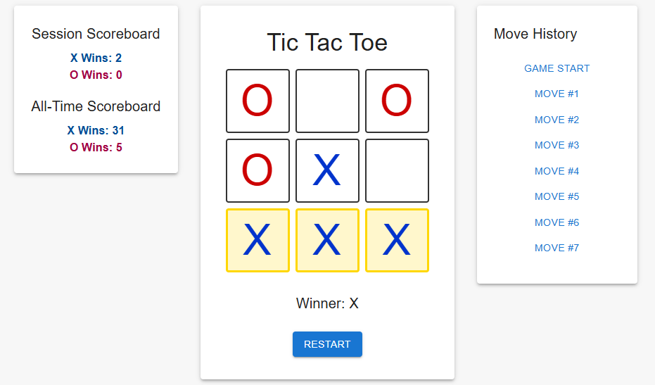

# Tic Tac Toe - React & TypeScript

A modern Tic Tac Toe web app built with **React**, **TypeScript**, and **Material UI**, featuring:

- Interactive board with **X** and **O** players
- **Move history** and ability to jump to any previous move
- **Session score tracking** (current game session)
- **All-time score tracking** (persisted on the server)
- Auto-updating **all-time scoreboard** every 3 seconds

---

## Table of Contents

- [Demo](#demo)
- [Features](#features)
- [Tech Stack](#tech-stack)
- [Project Structure](#project-structure)
- [Installation](#installation)
- [Running the App](#running-the-app)
- [API Endpoints](#api-endpoints)
- [Future Improvements](#future-improvements)

---

## Demo



---

## Features

- **Interactive Tic Tac Toe board**
- **Material UI design**: Creamy white background, X in FC Barcelona blue, O in red
- **Move history panel** with jump-to functionality
- **Session scoreboard**: Tracks X & O wins in the current session
- **All-time scoreboard**: Persisted on server and updated automatically
- **Server-side game history**: Stores all completed games for analytics

---

## Tech Stack

- **Frontend**: React, TypeScript, Material UI
- **Backend**: Node.js, Express, TypeScript
- **HTTP Requests**: Axios
- **State Management**: React Hooks (`useState`, `useEffect`)
- **Utilities**: Custom hooks for game logic & score management

---

## Project Structure

```
tic-tac-toe/
├── src/
│   ├── components/
│   │   ├── Board.tsx
│   │   └── Scoreboard.tsx
│   ├── hooks/
│   │   ├── useGame.ts
│   │   └── useVictories.ts
│   ├── services/
│   │   └── api.ts
│   ├── utils/
│   │   ├── calculateWinner.ts
│   │   └── getWinningSquares.ts
│   ├── App.tsx
│   └── index.tsx
├── server/
│   ├── index.ts
│   └── routes.ts
├── package.json
└── README.md
```

---

## Installation

1. **Clone the repository**

```bash
git clone https://github.com/yourusername/tic-tac-toe.git
cd tic-tac-toe
```

2. **Install frontend dependencies**

```bash
cd tic-tac-toe
npm install
```

3. **Install server dependencies**

```bash
cd server
npm install
```

---

## Running the App

1. **Start the server**

```bash
cd server
npm run dev
```

2. **Start the frontend**

```bash
cd tic-tac-toe
npm start
```

Open [http://localhost:3000](http://localhost:3000) in your browser.

---

## API Endpoints

### 1. Update victory

- **POST** `/victory/:player`
- **Params**: `player` – `"X"` or `"O"`
- **Description**: Increments all-time victory for the specified player.
- **Response**:

```json
{
  "allTimeVictories": {
    "X": 10,
    "O": 7
  }
}
```

### 2. Get all-time history

- **GET** `/history`
- **Description**: Returns an array of all past game winners.
- **Response**:

```json
["X", "O", "X", "X", "O"]
```

---

## Future Improvements

- **Leaderboard table** showing full game history
- **AI opponent** for single-player mode
- **Animations** for winning squares
- **Unit tests** for hooks and utilities
- **Mobile-friendly design** enhancements

---

## License

MIT License © \[Ariel Kerzhner]

---
